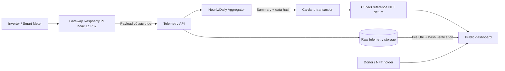

# Kịch bản buổi tư vấn kỹ thuật: Cardano cho dự án điện mặt trời từ thiện

## Thông tin buổi meet

| Hạng mục | Nội dung |
| --- | --- |
| Catalyst project | [HTLABS] 5 Project Templates Combining Blockchain and Internet of Things |
| Project ID | 1300008 |
| Milestone | Milestone 4 — Community Engagement and Impact Assessment |
| Hình thức | Một buổi meet trực tuyến có ghi hình |
| Thời lượng mục tiêu | 18 phút, có thể dao động trong khoảng 15–20 phút |
| Thành phần | Đại diện HTLabs, team dự án điện mặt trời từ thiện, cố vấn Cardano |
| Chủ đề | Tư vấn kiến trúc ghi nhận sản lượng điện mặt trời trên Cardano và gây quỹ bằng CIP-68 NFT |

> Đây là kịch bản chuẩn bị. Chỉ thay các phần `[PLACEHOLDER]` bằng dữ liệu đã được xác minh. Không tuyên bố giải pháp đã được triển khai nếu buổi meet mới chỉ dừng ở mức tư vấn kiến trúc.

## 1. Mục tiêu cần thể hiện trong video

Trong một video ngắn, reviewer phải nhìn thấy rõ bốn nội dung:

1. Team dự án bên ngoài giới thiệu dự án lắp đặt điện mặt trời từ thiện cho vùng khó khăn và bài toán đang cần hỗ trợ.
2. Cố vấn đặt câu hỏi để hiểu nguồn dữ liệu, thiết bị và mô hình vận hành.
3. Cố vấn đề xuất kiến trúc Cardano phù hợp, có liên hệ với kinh nghiệm của các IoT template do HTLabs xây dựng.
4. Hai bên thống nhất một hướng thử nghiệm tiếp theo, gồm telemetry điện mặt trời, CIP-68 NFT và phương án gây quỹ minh bạch.

## 2. Phân vai

| Vai trò | Người phụ trách | Nội dung chính |
| --- | --- | --- |
| Điều phối/đại diện HTLabs | `[TÊN, VAI TRÒ]` | Mở đầu, xác nhận ghi hình, quản lý thời gian và chốt kết quả |
| Đại diện team điện mặt trời | `[TÊN, VAI TRÒ, TÊN DỰ ÁN]` | Trình bày mục tiêu xã hội, quy trình triển khai và nhu cầu kỹ thuật |
| Cố vấn Cardano | `[TÊN, VAI TRÒ]` | Phân tích bài toán và đề xuất kiến trúc IoT–Cardano–CIP-68 |

## 3. Timeline 18 phút

| Thời gian | Nội dung | Người trình bày |
| --- | --- | --- |
| 00:00–01:00 | Giới thiệu, thành phần và xác nhận ghi hình | Điều phối |
| 01:00–05:00 | Trình bày dự án điện mặt trời từ thiện | Team dự án |
| 05:00–06:30 | Câu hỏi làm rõ | Cố vấn và team dự án |
| 06:30–12:30 | Đề xuất kiến trúc Cardano và cách liên kết dữ liệu với CIP-68 | Cố vấn |
| 12:30–15:30 | Mô hình NFT gây quỹ và các nguyên tắc minh bạch | Cố vấn |
| 15:30–17:00 | Team dự án phản hồi và thống nhất hướng thử nghiệm | Hai bên |
| 17:00–18:00 | Tóm tắt action items và kết thúc | Điều phối |

Nếu cần rút xuống 15 phút, giới hạn phần trình bày dự án còn 3 phút và phần kiến trúc còn 5 phút. Nếu có đủ 20 phút, dành thêm 2 phút cho câu hỏi kỹ thuật.

---

# 4. Kịch bản chi tiết

## 00:00–01:00 — Mở đầu và xác nhận ghi hình

### Điều phối

> Xin chào mọi người. Đây là buổi technical collaboration giữa HTLabs và `[TÊN DỰ ÁN ĐIỆN MẶT TRỜI]`.
>
> Buổi meet là một hoạt động thuộc Milestone 4 của Project Catalyst project 1300008. Mục tiêu hôm nay là tìm hiểu dự án điện mặt trời từ thiện của team, sau đó cố vấn sẽ đề xuất cách dùng Cardano để ghi nhận dữ liệu sản lượng điện và kết nối dữ liệu này với CIP-68 NFT nhằm hỗ trợ hoạt động gây quỹ.
>
> Buổi meet sẽ kéo dài khoảng 18 phút và được ghi hình làm bằng chứng công khai cho Project Catalyst. Mời các thành viên giới thiệu ngắn gọn tên, vai trò và xác nhận đồng ý ghi hình.

### Đại diện team dự án

> Tôi là `[TÊN]`, phụ trách `[VAI TRÒ]` tại `[TÊN DỰ ÁN]`. Tôi đồng ý buổi meet được ghi hình và công khai trong hồ sơ Project Catalyst.

### Cố vấn

> Tôi là `[TÊN]`, cố vấn về `[CARDANO/BLOCKCHAIN/SMART CONTRACT]`. Tôi đồng ý buổi meet được ghi hình và công khai trong hồ sơ Project Catalyst.

---

## 01:00–05:00 — Team trình bày dự án điện mặt trời từ thiện

### Đại diện team dự án

> Dự án của chúng tôi tập trung chế tạo, triển khai và lắp đặt hệ thống điện mặt trời cho các khu vực khó khăn, nơi khả năng tiếp cận nguồn điện ổn định còn hạn chế.
>
> Một dự án điển hình gồm các bước: khảo sát địa điểm, xác định nhu cầu sử dụng điện, lựa chọn tấm pin và inverter, huy động tài trợ, lắp đặt, bàn giao và theo dõi hệ thống sau triển khai.
>
> Hệ thống có thể thu thập các thông số như:
>
> - công suất tức thời, đơn vị W hoặc kW;
> - sản lượng điện theo ngày và sản lượng tích lũy, đơn vị kWh;
> - điện áp, dòng điện và trạng thái inverter;
> - thời gian hoạt động và thời điểm thiết bị gửi dữ liệu gần nhất.
>
> Hiện tại, các thông số này thường nằm trong thiết bị hoặc dashboard riêng của nhà sản xuất. Nhà tài trợ khó kiểm chứng công trình còn hoạt động hay đã tạo ra bao nhiêu điện sau khi lắp đặt.
>
> Team muốn tìm một giải pháp minh bạch hơn: dữ liệu điện được ghi nhận theo cách có thể kiểm chứng, mỗi công trình có một định danh số, và cộng đồng có thể mua NFT để đóng góp kinh phí cho việc lắp đặt thêm các hệ thống mới.
>
> Chúng tôi mong cố vấn hướng dẫn kiến trúc phù hợp trên Cardano, đặc biệt là cách liên kết dữ liệu sản lượng điện với CIP-68 NFT mà không làm hệ thống quá phức tạp hoặc tốn nhiều phí giao dịch.

### Hình ảnh nên share trong phần này

Team chỉ cần một slide gồm:

- một ảnh hệ thống điện mặt trời hoặc sơ đồ dự kiến;
- khu vực thụ hưởng;
- thiết bị đo/inverter dự kiến;
- bốn chỉ số: `current_power_kw`, `daily_energy_kwh`, `total_energy_kwh`, `last_reported_at`;
- vấn đề cần giải quyết: minh bạch dữ liệu và gây quỹ.

Không hiển thị địa chỉ nhà riêng, thông tin cá nhân của người thụ hưởng, API key hoặc thông tin truy cập thiết bị.

---

## 05:00–06:30 — Cố vấn đặt câu hỏi làm rõ

### Cố vấn

> Cảm ơn team. Trước khi đề xuất kiến trúc, tôi xin xác nhận một số điểm.
>
> Thứ nhất, inverter hoặc smart meter có API, Modbus, cổng serial hay cách nào để gateway đọc dữ liệu tự động không?

### Team dự án

> `[TRẢ LỜI THỰC TẾ VỀ THIẾT BỊ VÀ GIAO THỨC]`.

### Cố vấn

> Thứ hai, địa điểm lắp đặt có Internet liên tục không, hay gateway cần lưu dữ liệu tạm thời khi mất kết nối?

### Team dự án

> `[TRẢ LỜI THỰC TẾ VỀ KẾT NỐI]`.

### Cố vấn

> Thứ ba, team muốn cập nhật dữ liệu theo thời gian thực, theo giờ hay theo ngày? Với mục tiêu minh bạch cho nhà tài trợ, bản tổng hợp theo giờ hoặc theo ngày thường hợp lý hơn việc ghi từng mẫu đo lên blockchain.

### Team dự án

> `[TẦN SUẤT MONG MUỐN]`.

### Cố vấn tóm tắt

> Như vậy, đầu vào là dữ liệu từ `[INVERTER/SMART METER]`, kết nối `[LIÊN TỤC/CHẬP CHỜN]`, và team cần công khai bản tổng hợp `[THEO GIỜ/THEO NGÀY]`. Mục tiêu không phải thay thế toàn bộ hệ thống giám sát, mà tạo một lớp dữ liệu có thể kiểm chứng và liên kết với tài sản CIP-68 trên Cardano.

---

## 06:30–12:30 — Cố vấn đề xuất kiến trúc

### Cố vấn

> Tôi đề xuất kiến trúc gồm năm lớp.

### Lớp 1 — Thiết bị đo tại công trình

> Inverter hoặc smart meter thu thập công suất, sản lượng điện và trạng thái hoạt động. Một gateway như Raspberry Pi hoặc ESP32 đọc dữ liệu qua API, Modbus hoặc serial.
>
> Mỗi bản ghi nên có `site_id`, thời gian đo, công suất, sản lượng điện và trạng thái thiết bị. Gateway cần kiểm tra dữ liệu hợp lệ trước khi gửi. Ví dụ, giá trị 0 kW vào ban đêm có thể là dữ liệu hợp lệ, không nên tự động coi là lỗi.

### Lớp 2 — Gateway và chữ ký thiết bị

> Gateway ký payload hoặc gửi payload qua một kênh xác thực tới backend. Khi mất Internet, gateway lưu dữ liệu vào queue cục bộ và gửi lại sau. Mỗi bản ghi hoặc batch cần có ID để backend loại bỏ dữ liệu trùng khi retry.
>
> Phần này áp dụng kinh nghiệm từ IoT1 về validation/retry và IoT3 về vận hành thiết bị trong điều kiện kết nối không ổn định.

### Lớp 3 — Backend tổng hợp dữ liệu

> Backend nhận dữ liệu, kiểm tra nguồn gửi và lưu raw telemetry trong cơ sở dữ liệu hoặc object storage. Sau đó backend tổng hợp theo giờ hoặc theo ngày.
>
> Không nên đưa từng mẫu đo lên blockchain. Cách đó tốn phí, tạo nhiều giao dịch và không cần thiết cho mục tiêu minh bạch. Cardano chỉ cần lưu bản tổng hợp và hash của file dữ liệu chi tiết.

Ví dụ dữ liệu tổng hợp:

```json
{
  "site_id": "SOLAR-SITE-001",
  "period": "[YYYY-MM-DD]",
  "energy_kwh": 18.42,
  "total_energy_kwh": 1247.68,
  "uptime_percent": 98.7,
  "raw_data_uri": "ipfs://...",
  "raw_data_hash": "sha256:...",
  "last_reported_at": "[ISO-8601 TIMESTAMP]"
}
```

> Raw data có thể nằm ở IPFS, object storage hoặc kho dữ liệu công khai phù hợp. Hash trên Cardano cho phép kiểm tra file có bị thay đổi hay không.

### Lớp 4 — CIP-68 reference NFT trên Cardano

> Mỗi công trình điện mặt trời có thể có một CIP-68 asset làm định danh số.
>
> Theo CIP-68, reference token giữ metadata trong datum tại một script address, còn user token nằm trong ví người sở hữu. Metadata có thể cập nhật khi có báo cáo sản lượng mới.

Metadata đề xuất:

```json
{
  "name": "Solar Charity Site 001",
  "project_id": "SOLAR-SITE-001",
  "region": "[KHU VỰC Ở MỨC KHÔNG LỘ THÔNG TIN CÁ NHÂN]",
  "installed_capacity_kwp": 5.0,
  "installation_date": "[YYYY-MM-DD]",
  "current_power_kw": 2.18,
  "daily_energy_kwh": 18.42,
  "total_energy_kwh": 1247.68,
  "last_reported_at": "[ISO-8601 TIMESTAMP]",
  "telemetry_uri": "ipfs://...",
  "telemetry_hash": "sha256:..."
}
```

> Smart contract chỉ cho phép địa chỉ vận hành hoặc multisig đã được xác định cập nhật datum. Người giữ NFT gây quỹ không nên mặc nhiên có quyền sửa số liệu điện.
>
> Mô hình này dựa trên template IoT5 của HTLabs: reference token được giữ tại contract address, metadata được cập nhật trong datum, còn lịch sử giao dịch tạo ra audit trail.

### Lớp 5 — Dashboard công khai

> Dashboard đọc CIP-68 datum để hiển thị thông tin công trình, sản lượng gần nhất, tổng sản lượng và link tới dữ liệu chi tiết. Nhà tài trợ có thể kiểm tra transaction và hash mà không cần truy cập dashboard riêng của nhà sản xuất inverter.

### Sơ đồ kiến trúc trình chiếu



---

## 12:30–15:30 — Cố vấn đề xuất mô hình NFT gây quỹ

### Cố vấn

> Về gây quỹ, có hai mô hình để team cân nhắc.

### Phương án A — Một NFT đại diện cho một công trình

> Team mint một CIP-68 NFT cho mỗi công trình. User token có thể được bán hoặc đấu giá cho một nhà tài trợ chính. NFT đóng vai trò chứng nhận tài trợ và link tới dữ liệu sản lượng của công trình.
>
> Mô hình này đơn giản nhưng mỗi công trình chỉ có một người giữ NFT tại một thời điểm. Team cũng phải quy định rõ rằng NFT mang ý nghĩa ghi nhận đóng góp, không phải quyền sở hữu tấm pin, sản lượng điện hoặc doanh thu của công trình.

### Phương án B — Tách Site NFT và Supporter NFT

> Đây là phương án tôi khuyến nghị nếu dự án muốn huy động từ nhiều người.
>
> - `Site Identity NFT`: một asset cho mỗi công trình, giữ định danh và telemetry. Asset này không bán; quyền cập nhật thuộc multisig hoặc smart contract của dự án.
> - `Supporter NFT`: nhiều NFT dành cho người đóng góp. Metadata của mỗi Supporter NFT link tới policy ID hoặc asset ID của Site Identity NFT.
>
> Cách tách này giúp team bán nhiều NFT để gây quỹ mà vẫn giữ quyền cập nhật dữ liệu kỹ thuật ổn định. Việc chuyển Supporter NFT giữa các ví không ảnh hưởng tới telemetry của công trình.

### Cố vấn về minh bạch gây quỹ

> Trang mint hoặc tài liệu gây quỹ nên công khai:
>
> - mục tiêu gọi vốn;
> - số tiền dùng cho thiết bị, vận chuyển, lắp đặt và bảo trì;
> - ví nhận quỹ;
> - tiến độ triển khai;
> - transaction hoặc bằng chứng chi tiêu phù hợp;
> - điều người mua NFT thực sự nhận được.
>
> Không nên quảng bá NFT như một khoản đầu tư hoặc hứa lợi nhuận từ sản lượng điện nếu dự án chưa có cấu trúc pháp lý phù hợp. NFT nên được mô tả là chứng nhận đóng góp hoặc vật phẩm cộng đồng. Team cũng cần kiểm tra yêu cầu pháp lý và thuế tại nơi tổ chức gây quỹ trước khi bán công khai.

---

## 15:30–17:00 — Team phản hồi và thống nhất hướng thử nghiệm

### Điều phối

> Cảm ơn phần tư vấn. Team dự án đánh giá hướng nào phù hợp nhất cho giai đoạn thử nghiệm?

### Đại diện team dự án

> Hướng tư vấn phù hợp với nhu cầu của chúng tôi. Trước mắt, team sẽ chọn một công trình pilot và xác định cách đọc dữ liệu từ inverter hoặc smart meter.
>
> Team đồng ý thử nghiệm kiến trúc gateway gửi dữ liệu về backend, tổng hợp sản lượng theo ngày, lưu hash của dữ liệu chi tiết lên Cardano và liên kết bản tổng hợp với CIP-68 Site Identity NFT.
>
> Đối với gây quỹ, team sẽ nghiên cứu mô hình tách Site Identity NFT và Supporter NFT để nhiều người có thể đóng góp mà không ảnh hưởng tới quyền cập nhật telemetry.

### Cố vấn

> Tôi đề nghị pilot chỉ cần chứng minh một luồng hoàn chỉnh:
>
> 1. đọc dữ liệu từ một thiết bị hoặc simulator;
> 2. tạo một bản tổng hợp theo ngày;
> 3. tạo hash cho file telemetry;
> 4. cập nhật CIP-68 datum trên Cardano preprod;
> 5. hiển thị dữ liệu và transaction trên một trang công khai.
>
> Sau khi luồng này hoạt động ổn định, team mới mở rộng sang nhiều công trình và xây dựng chiến dịch Supporter NFT.

---

## 17:00–18:00 — Chốt action items

### Điều phối

> Em xin tóm tắt kết quả buổi meet.
>
> Team dự án đã trình bày bài toán triển khai điện mặt trời từ thiện, nhu cầu minh bạch sản lượng điện và mong muốn gây quỹ bằng NFT.
>
> Cố vấn đề xuất kiến trúc gồm thiết bị đo, gateway, telemetry backend, lớp tổng hợp dữ liệu, Cardano và CIP-68. Dữ liệu chi tiết không được ghi từng mẫu lên blockchain; hệ thống lưu bản tổng hợp, URI và hash để giảm chi phí nhưng vẫn kiểm chứng được.
>
> Hai bên thống nhất hướng pilot là một công trình, dữ liệu tổng hợp theo ngày và một CIP-68 Site Identity NFT trên Cardano preprod. Mô hình Supporter NFT sẽ được nghiên cứu cho giai đoạn gây quỹ.

### Action items hiển thị trên màn hình

| Việc cần làm | Người phụ trách | Kết quả mong đợi |
| --- | --- | --- |
| Xác định inverter/smart meter và giao thức lấy dữ liệu | Team dự án | Datasheet hoặc API/Modbus mapping |
| Chọn 4–6 chỉ số telemetry cho pilot | Team dự án + cố vấn | Schema dữ liệu được thống nhất |
| Thiết kế payload và quy tắc tổng hợp theo ngày | Cố vấn/HTLabs | Ví dụ JSON và validation rules |
| Thử nghiệm CIP-68 Site Identity NFT trên Cardano preprod | Team kỹ thuật | Mint transaction và một datum update |
| Thiết kế mô hình Supporter NFT và công khai mục đích sử dụng quỹ | Team dự án | Draft fundraising model |

### Điều phối kết thúc

> Cảm ơn team dự án và cố vấn. Buổi meet đã cung cấp một hướng kiến trúc cụ thể và action plan để team tiếp tục thử nghiệm. Video và phần tóm tắt sẽ được công khai trong hồ sơ Milestone 4 của Project Catalyst project 1300008.

---

# 5. Tài liệu nên xuất hiện trong video

Để video tự nó đủ sức chứng minh hoạt động collaboration, nên share lần lượt ba slide:

1. **Project problem:** mục tiêu từ thiện, mô hình công trình điện mặt trời, thông số có thể thu thập và vấn đề minh bạch.
2. **Proposed architecture:** sơ đồ Inverter → Gateway → Backend → Cardano → CIP-68 → Dashboard.
3. **Decision and action plan:** hướng pilot và người phụ trách.

Video cần ghi được:

- tên và vai trò của đại diện hai bên;
- xác nhận đồng ý ghi hình;
- team dự án tự trình bày bài toán;
- cố vấn hướng dẫn kiến trúc cụ thể;
- liên hệ với kinh nghiệm IoT1, IoT3 và IoT5 của HTLabs;
- team dự án xác nhận hướng tư vấn hữu ích và chấp nhận action plan.

## Link tham chiếu dùng khi share màn hình

- [IoT1 — DHT22 sensor data store](https://github.com/htlabs-xyz/cardano-iot-example/tree/master/iot1-sensor-data-store)
- [IoT3 — Vending machine payment monitor](https://github.com/htlabs-xyz/cardano-iot-example/tree/master/iot3-vending-machines)
- [IoT5 — CIP-68 QR supply-chain traceability](https://github.com/htlabs-xyz/cardano-iot-example/tree/master/iot5-qr-code-traceability)
- [Official CIP-68 specification](https://cips.cardano.org/cip/CIP-68)

---

# 6. Đoạn PoA tiếng Anh sau khi buổi meet hoàn thành

Chỉ điền và sử dụng phần này sau khi có video thật:

> **Output: Technical collaboration with a charitable solar-energy project**
>
> HTLabs held a recorded technical advisory meeting with `[PARTNER PROJECT]`, a project that manufactures, deploys, and installs charitable solar-energy systems in underserved areas. The project team presented its need to make solar production data verifiable and to explore NFT-based fundraising.
>
> The Cardano advisor proposed an architecture in which an inverter or smart meter sends telemetry through an authenticated IoT gateway to an off-chain aggregation service. Detailed readings remain in a data store, while daily energy summaries, a data URI, and a content hash are recorded through a CIP-68 reference NFT on Cardano. This design applies lessons from HTLabs' IoT1 sensor-data, IoT3 embedded-connectivity, and IoT5 CIP-68 traceability templates.
>
> The advisor also recommended separating the project-controlled operational identity of each solar site from transferable Supporter NFTs. This allows the project to raise funds from multiple contributors without transferring the authority that updates technical telemetry.
>
> The participants agreed to build a pilot for one solar site on Cardano preprod, using daily energy summaries and a CIP-68 Site Identity NFT.
>
> **Evidence:** Recorded technical collaboration meeting: `[PUBLIC VIDEO URL]`

# 7. Quality gate trước khi công khai video

- [ ] Buổi meet nằm trong khoảng 15–20 phút.
- [ ] Tên dự án đối tác và người tham gia là thông tin thật.
- [ ] Tất cả người tham gia xác nhận đồng ý ghi hình.
- [ ] Team dự án trình bày bài toán bằng lời của chính họ.
- [ ] Thông số thiết bị và giao thức kết nối phản ánh đúng thiết bị dự kiến sử dụng.
- [ ] Cố vấn không tuyên bố dữ liệu đã lên Cardano nếu mới chỉ đề xuất kiến trúc.
- [ ] Video hiển thị kiến trúc và action plan.
- [ ] Không lộ mnemonic, private key, API key hoặc thông tin cá nhân của người thụ hưởng.
- [ ] NFT được mô tả rõ là chứng nhận đóng góp/vật phẩm cộng đồng, không phải cam kết lợi nhuận.
- [ ] Link video mở được ở chế độ công khai.
